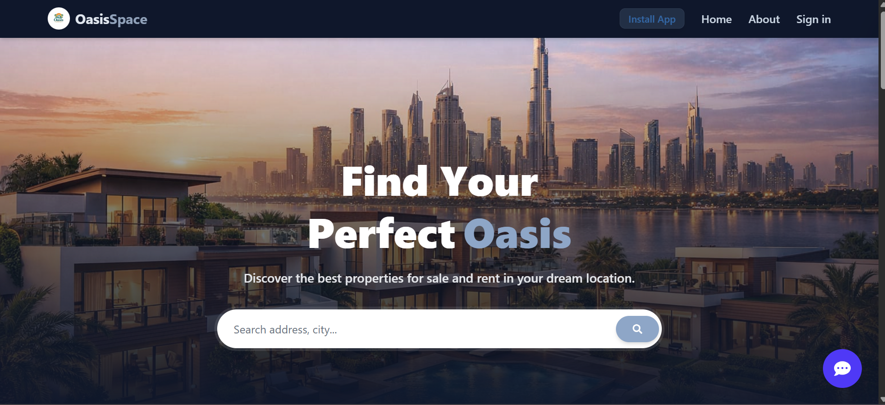
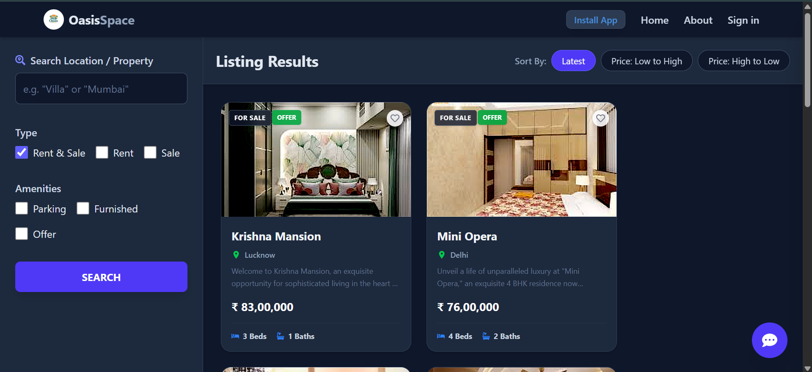
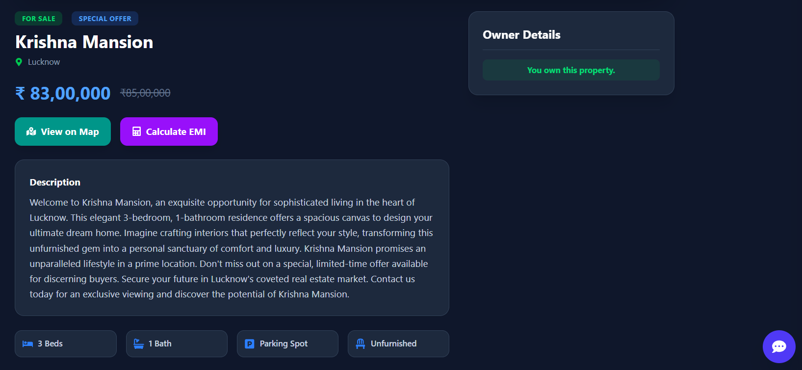
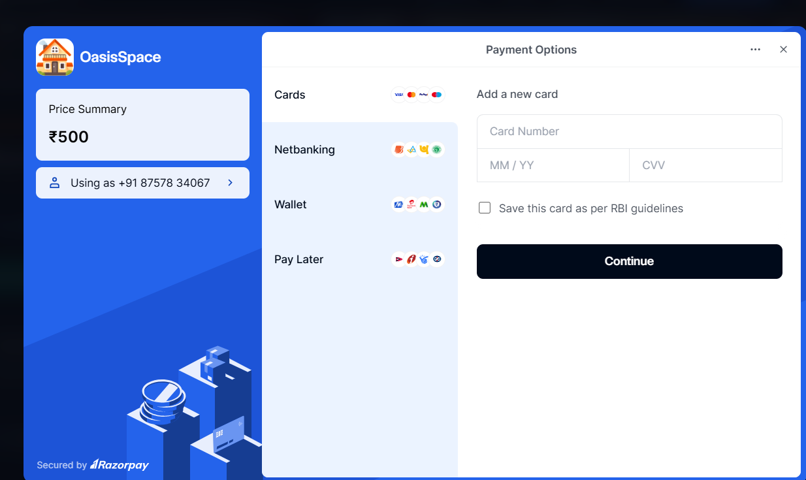
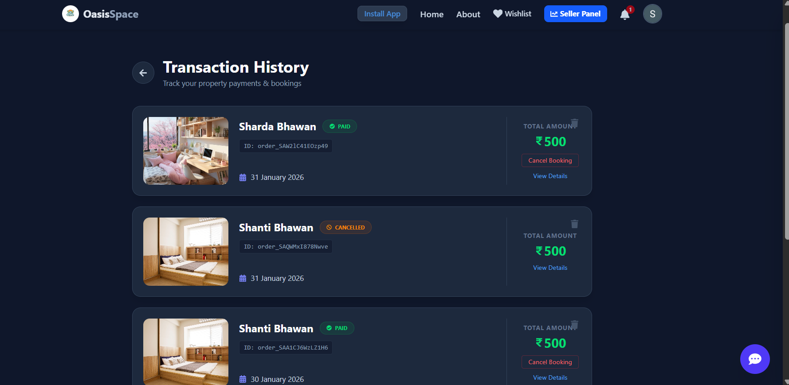
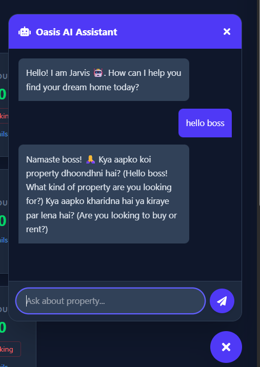
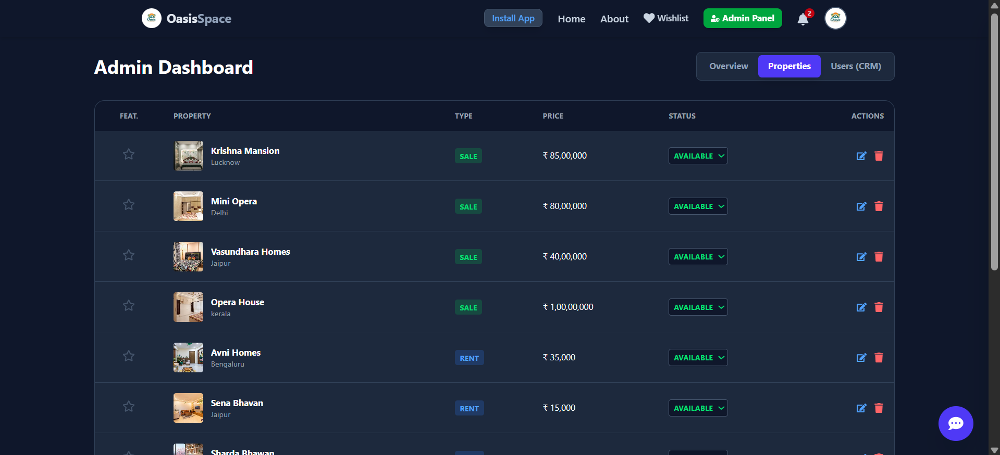
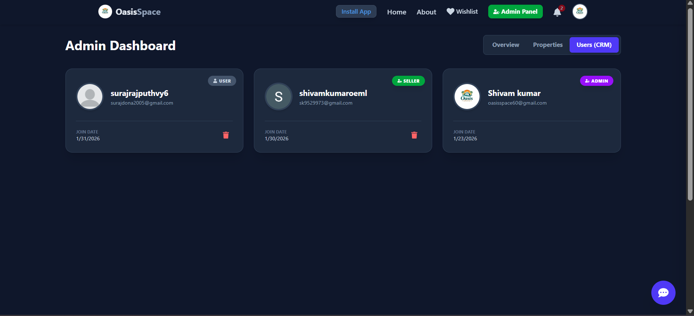

<p align="center">
  
</p>

<h1 align="center">🏡 OasisSpace — Premium Real Estate Platform</h1>

<p align="center">
  <strong>Find Your Perfect Oasis — Buy, Sell, or Rent Properties with Ease</strong>
</p>

<p align="center">
  <a href="https://oasis-space.vercel.app/">
    
  </a>
  <a href="https://github.com/shivamsingh7533/oasis-space">
    
  </a>
</p>

<p align="center">
  
  
  
  
  
  
</p>

---

## 📖 Overview

**OasisSpace** is a modern, full-stack real estate marketplace that empowers users to discover, list, buy, rent, and sell properties seamlessly. Built with cutting-edge technologies, it features an AI-powered chatbot, integrated payment processing, role-based access control, and a stunning dark-themed UI.

Whether you're a property seeker, seller, or admin, OasisSpace provides an intuitive and feature-rich experience for all your real estate needs.

---

## ✨ Key Features

### 🏠 **Property Management**
- 📝 Create, edit, and delete property listings
- 🖼️ Multi-image upload with room/area labels
- 🏷️ Property types: **Sale** & **Rent**
- ⭐ Featured/VIP property highlighting
- 📊 Status tracking: Available, Sold, Rented
- 🔍 Advanced search with filters (location, price, bedrooms, etc.)

### 🤖 **AI-Powered Features**
- 💬 **Jarvis AI Chatbot** — Real-time property assistant powered by Groq LLaMA 3.3
- ✍️ **AI Description Generator** — Auto-generate SEO-friendly property descriptions using Google Gemini

### 💳 **Payment Integration**
- 💰 **Razorpay** payment gateway for secure bookings
- 📜 Complete order history with transaction tracking
- 🧮 **EMI/Mortgage Calculator** — Estimate monthly payments instantly

### 🔐 **Authentication & Security**
- 🔑 Email/Password signup with **OTP verification** via Brevo
- 🌐 **Google OAuth** authentication via Firebase
- 🔒 JWT-based session management with secure cookies
- 🛡️ Protected routes for users, sellers, and admins

### 👥 **Role-Based Access Control**
| Role | Capabilities |
|------|-------------|
| **User** | Browse, save listings, contact landlords, make payments |
| **Seller** | List properties for rent (sale requires approval) |
| **Approved Seller** | List properties for both sale and rent |
| **Admin** | Manage users, approve sellers, feature listings, view analytics |

### 📬 **Email Notifications**
- Welcome emails for new users
- OTP verification emails
- Seller approval/rejection notifications
- Contact landlord feature with direct email

### 📱 **Progressive Web App (PWA)**
- 📲 Installable on mobile devices
- ⚡ Fast, app-like experience
- 🔔 Works offline with service workers

---

## 🛠️ Tech Stack

### **Frontend**
| Technology | Purpose |
|------------|---------|
| [React 19](https://react.dev/) | UI Framework |
| [Vite 7](https://vitejs.dev/) | Build Tool & Dev Server |
| [TailwindCSS 4](https://tailwindcss.com/) | Styling |
| [Redux Toolkit](https://redux-toolkit.js.org/) | State Management |
| [Redux Persist](https://github.com/rt2zz/redux-persist) | State Persistence |
| [React Router v7](https://reactrouter.com/) | Routing |
| [Framer Motion](https://www.framer.com/motion/) | Animations |
| [Swiper](https://swiperjs.com/) | Image Carousels |
| [Leaflet](https://leafletjs.com/) | Interactive Maps |
| [Recharts](https://recharts.org/) | Dashboard Charts |
| [Firebase](https://firebase.google.com/) | Google OAuth |
| [Supabase](https://supabase.com/) | Image Storage |

### **Backend**
| Technology | Purpose |
|------------|---------|
| [Node.js](https://nodejs.org/) | Runtime Environment |
| [Express.js](https://expressjs.com/) | Web Framework |
| [MongoDB](https://www.mongodb.com/) | Database |
| [Mongoose](https://mongoosejs.com/) | ODM |
| [JWT](https://jwt.io/) | Authentication |
| [bcryptjs](https://www.npmjs.com/package/bcryptjs) | Password Hashing |
| [Razorpay](https://razorpay.com/) | Payment Gateway |
| [Brevo (Sendinblue)](https://www.brevo.com/) | Email Service |
| [Groq SDK](https://groq.com/) | AI Chatbot (LLaMA 3.3) |
| [Google Generative AI](https://ai.google.dev/) | AI Description Generator |

---

## 📸 Screenshots

### 🏠 Home Page — Hero Section
> Beautiful landing page with animated hero, search bar, and featured properties carousel

<p align="center">
  
</p>

---

### 🔍 Property Search & Filters
> Advanced search with filters for property type, price range, bedrooms, amenities, and sorting options

<p align="center">
  
</p>

---

### 📝 Listing Details Page
> Comprehensive property view with image gallery, description, EMI calculator, and contact options

<p align="center">
  
</p>

---

### 💳 Razorpay Payment Integration
> Secure payment gateway with multiple payment options (Cards, UPI, Netbanking, Wallets)

<p align="center">
  
</p>

---

### 📜 Transaction History
> Complete order history with booking details, payment status, and cancellation options

<p align="center">
  
</p>

---

### 🤖 Jarvis AI Chatbot
> Intelligent real estate assistant powered by Groq LLaMA 3.3 for instant property recommendations

<p align="center">
  
</p>

---

### 📊 Admin Dashboard — Overview
> Real-time analytics with revenue tracking, inventory value, and key metrics

<p align="center">
  
</p>

---

### 🏘️ Admin Dashboard — Property Management
> Complete listing management with featured toggle, status updates, and quick actions

<p align="center">
  
</p>

---

### 👥 Admin Dashboard — User Management
> Role-based user management with seller verification and account controls

<p align="center">
  
</p>

---

## 📁 Project Structure

```
oasis-space/
├── client/                    # Frontend (React + Vite)
│   ├── public/                # Static assets
│   │   └── logo.png           # Brand logo
│   ├── src/
│   │   ├── assets/            # Images & static files
│   │   ├── components/        # Reusable UI components
│   │   │   ├── Header.jsx     # Navigation header
│   │   │   ├── Footer.jsx     # Footer component
│   │   │   ├── ChatWidget.jsx # AI Chatbot widget
│   │   │   ├── RazorpayBtn.jsx# Payment button
│   │   │   ├── EMICalculator.jsx # Mortgage calculator
│   │   │   ├── ListingItem.jsx# Property card
│   │   │   └── OAuth.jsx      # Google auth button
│   │   ├── pages/             # Route pages
│   │   │   ├── Home.jsx       # Landing page
│   │   │   ├── Search.jsx     # Property search
│   │   │   ├── Listing.jsx    # Single property view
│   │   │   ├── Profile.jsx    # User profile
│   │   │   ├── Dashboard.jsx  # Admin dashboard
│   │   │   ├── SellerDashboard.jsx # Seller analytics
│   │   │   └── CreateListing.jsx   # New listing form
│   │   ├── redux/             # State management
│   │   │   ├── store.js       # Redux store config
│   │   │   └── user/          # User slice
│   │   ├── App.jsx            # Root component
│   │   ├── firebase.js        # Firebase config
│   │   └── supabase.js        # Supabase config
│   ├── index.html             # Entry HTML
│   ├── vite.config.js         # Vite configuration
│   ├── tailwind.config.js     # Tailwind configuration
│   └── package.json           # Frontend dependencies
│
├── server/                    # Backend (Node.js + Express)
│   ├── controllers/           # Business logic
│   │   ├── auth.controller.js # Authentication handlers
│   │   ├── user.controller.js # User management
│   │   ├── listing.controller.js # Property CRUD
│   │   ├── order.controller.js   # Payment handling
│   │   ├── chat.controller.js    # AI chatbot
│   │   └── notification.controller.js # Notifications
│   ├── models/                # MongoDB schemas
│   │   ├── user.model.js      # User schema
│   │   ├── listing.model.js   # Property schema
│   │   ├── order.model.js     # Order schema
│   │   └── notification.model.js # Notification schema
│   ├── routes/                # API route definitions
│   ├── utils/                 # Utility functions
│   │   ├── error.js           # Error handler
│   │   ├── sendEmail.js       # Email service
│   │   └── verifyUser.js      # JWT verification
│   ├── index.js               # Server entry point
│   └── package.json           # Backend dependencies
│
└── README.md                  # This file
```

---

## ⚡ Quick Start

### Prerequisites
- **Node.js** v18+ 
- **MongoDB** (local or Atlas)
- **npm** or **yarn**

### 1️⃣ Clone the Repository
```bash
git clone https://github.com/shivamsingh7533/oasis-space.git
cd oasis-space
```

### 2️⃣ Setup Backend
```bash
cd server
npm install
```

Create a `.env` file in the `server` folder:
```env
# Database
MONGO=mongodb+srv://your-connection-string

# JWT
JWT_SECRET=your_jwt_secret_key

# Environment
NODE_ENV=development
CLIENT_URL=http://localhost:5173

# Email (Brevo)
BREVO_API_KEY=your_brevo_api_key

# Razorpay
RAZORPAY_KEY_ID=your_razorpay_key_id
RAZORPAY_KEY_SECRET=your_razorpay_secret

# AI Services
GROQ_API_KEY=your_groq_api_key
GEMINI_API_KEY=your_gemini_api_key
```

Start the server:
```bash
npm start
```

### 3️⃣ Setup Frontend
```bash
cd ../client
npm install
```

Create a `.env` file in the `client` folder:
```env
# API
VITE_API_URL=http://localhost:3000

# Firebase (Google Auth)
VITE_FIREBASE_API_KEY=your_firebase_api_key
VITE_AUTH_DOMAIN=your_project.firebaseapp.com
VITE_PROJECT_ID=your_project_id
VITE_STORAGE_BUCKET=your_project.appspot.com
VITE_MESSAGING_SENDER_ID=your_sender_id
VITE_APP_ID=your_app_id

# Supabase (Image Storage)
VITE_SUPABASE_URL=https://your-project.supabase.co
VITE_SUPABASE_KEY=your_supabase_anon_key

# Razorpay
VITE_RAZORPAY_KEY_ID=your_razorpay_key_id
```

Start the development server:
```bash
npm run dev
```

### 4️⃣ Open in Browser
Navigate to `http://localhost:5173`

---

## 🔗 API Endpoints

### Authentication
| Method | Endpoint | Description |
|--------|----------|-------------|
| POST | `/api/auth/signup` | Register new user |
| POST | `/api/auth/verify-email` | Verify OTP |
| POST | `/api/auth/signin` | User login |
| POST | `/api/auth/google` | Google OAuth |
| POST | `/api/auth/forgot-password` | Password reset request |
| POST | `/api/auth/reset-password/:id/:token` | Reset password |
| GET | `/api/auth/signout` | Logout |

### Listings
| Method | Endpoint | Description |
|--------|----------|-------------|
| GET | `/api/listing/get` | Get listings with filters |
| GET | `/api/listing/get/:id` | Get single listing |
| POST | `/api/listing/create` | Create listing |
| POST | `/api/listing/update/:id` | Update listing |
| DELETE | `/api/listing/delete/:id` | Delete listing |
| POST | `/api/listing/feature/:id` | Toggle featured |
| POST | `/api/listing/ai-description` | Generate AI description |

### Users
| Method | Endpoint | Description |
|--------|----------|-------------|
| GET | `/api/user/:id` | Get user info |
| POST | `/api/user/update/:id` | Update profile |
| DELETE | `/api/user/delete/:id` | Delete account |
| GET | `/api/user/listings/:id` | Get user's listings |
| POST | `/api/user/save/:id` | Save/unsave listing |
| GET | `/api/user/saved` | Get saved listings |
| POST | `/api/user/request-seller` | Request seller status |
| GET | `/api/user/seller-dashboard` | Seller analytics |

### Orders
| Method | Endpoint | Description |
|--------|----------|-------------|
| POST | `/api/order/create` | Create Razorpay order |
| POST | `/api/order/verify` | Verify payment |
| GET | `/api/order/user/:userId` | Get user orders |

### Chat
| Method | Endpoint | Description |
|--------|----------|-------------|
| POST | `/api/chat/ask` | Chat with AI assistant |

---

## 🚀 Deployment

### Frontend (Vercel)
The frontend is deployed on **Vercel** with automatic deployments from the main branch.

### Backend (Render/Railway)
The backend API can be deployed on platforms like **Render**, **Railway**, or **Heroku**.

> **Note:** Ensure environment variables are configured in your deployment platform.

---

## 🤝 Contributing

Contributions are welcome! Please follow these steps:

1. Fork the repository
2. Create a feature branch: `git checkout -b feature/amazing-feature`
3. Commit changes: `git commit -m 'Add amazing feature'`
4. Push to branch: `git push origin feature/amazing-feature`
5. Open a Pull Request

---

## 📄 License

This project is open source and available under the [MIT License](LICENSE).

---

## 👨‍💻 Author

<p align="center">
  <strong>Shivam Kumar</strong><br/><br/>
  <a href="https://github.com/shivamsingh7533">
    
  </a>
  <a href="https://www.linkedin.com/in/shivam-kumar-b61784293/">
    
  </a>
</p>

---

<p align="center">
  <strong>⭐ If you found this project helpful, please give it a star! ⭐</strong>
</p>

<p align="center">
  Made with ❤️ in India 🇮🇳
</p>
